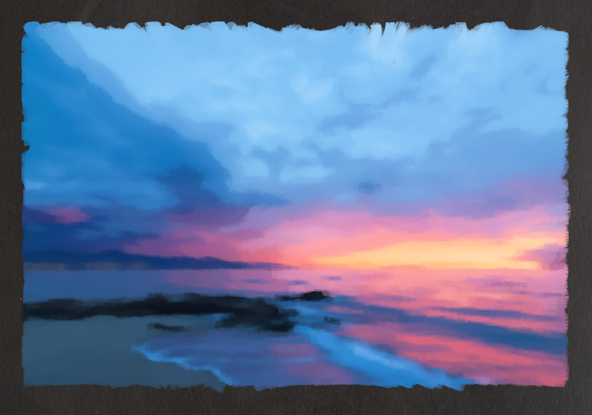
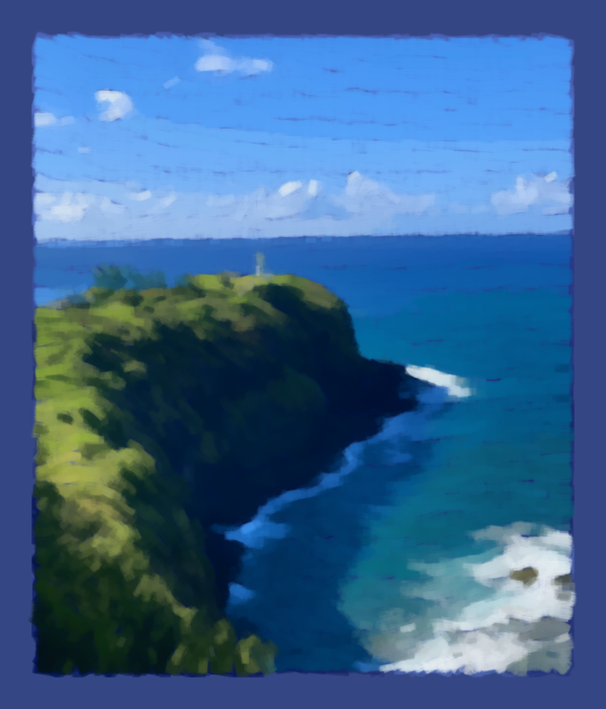
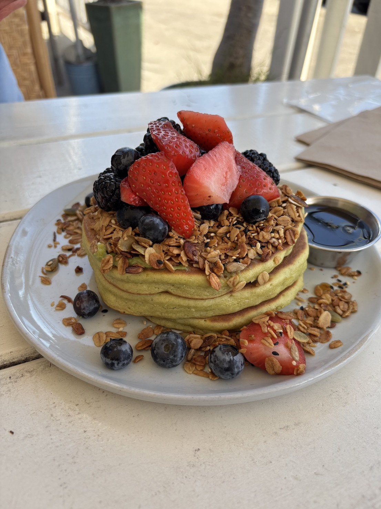
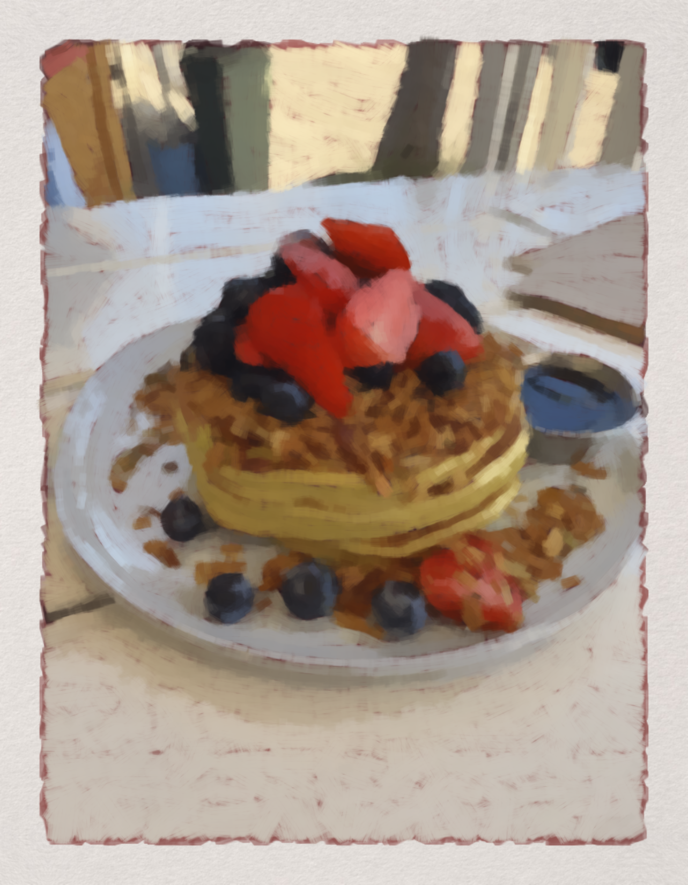

# Prism Lab - A Computational Toolkit for Painterly Rendering

## Overview

Prism Lab is a computational toolkit for stroke-based painterly rendering. It reconstructs a reference image through a layered process. The system analyzes tone, color, and structure, then renders the scene with strokes in a chosen medium, such as acrylic or gouache, over a configurable ground and underpainting.

Its purpose is to study how perceptual abstraction and stroke-based rendering convey the essential structure of a scene with far less visual information than the source image. It also examines how the visual properties of painting media can be represented through computational models of brush, paint, and canvas interactions.
## Experiments

| Original Image | Stroke-Based Rendering |
| --- | --- |
|  |  |
|  |  |
|  |  |
|  |  |
|  |  |
